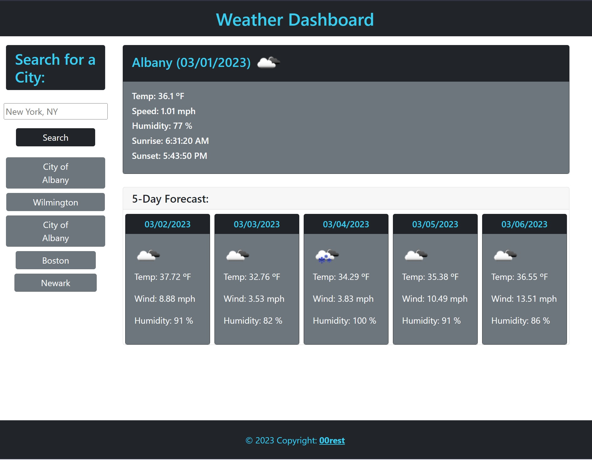

# 06 Server-Side APIs: Weather Dashboard

Gorgeous weather application for all your travel needs.

Using the [5 Day Weather Forecast](https://openweathermap.org/forecast5) to retrieve weather data for cities and `localStorage` to store any persistent data, we were able to create one of the best pages on the internet regarding weather forecasting.

```
AS A traveler
If you WANT to see the weather outlook for multiple cities SO THAT you can plan a trip accordingly, you can by clickin on the link bellow and enter the city in question.

```


The following image shows the web application's appearance and functionality:



[Weather Dashboard](https://00rest.github.io/Challenge-06-Server-Side-APIs/)


```
GIVEN a weather dashboard with form inputs
WHEN you search for a city
THEN you are presented with current and future conditions for that city and that city is added to the search history
WHEN you view current weather conditions for that city
THEN you are presented with the city name, the date, an icon representation of weather conditions, the temperature, the humidity, and the wind speed
WHEN you view future weather conditions for that city
THEN you are presented with a 5-day forecast that displays the date, an icon representation of weather conditions, the temperature, the wind speed, and the humidity
WHEN you click on a city in the search history
THEN you are again presented with current and future conditions for that city
```